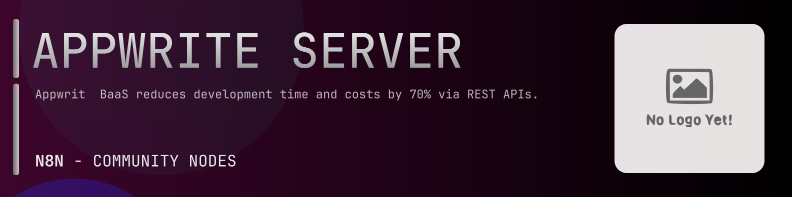

# @n8n-dev/n8n-nodes-appwrite-server



[](https://www.npmjs.com/package/@n8n-dev/n8n-nodes-appwrite-server)
[](https://opensource.org/licenses/MIT)

---

**Stop writing appwrite-server API integrations by hand.**

Every time you connect n8n to appwrite-server, you waste hours mapping endpoints, defining parameters, and debugging schemas. You copy-paste from docs, fix edge cases, and pray nothing breaks.

**What if connecting n8n to appwrite-server took 5 minutes, not half a day?**

This node gives you **10+ resources** out of the box: **Account**, **Avatars**, **Database**, **Locale**, **Health**, and 5 more: with full CRUD operations, typed parameters, and zero manual configuration.

---

## What You Get

- **Zero boilerplate**: Resources, operations, and fields are pre-configured and ready to use
- **Full CRUD**: Create, read, update, and delete support where the API allows it
- **Typed parameters**: No more guessing field types
- **Built-in auth**: API key authentication, ready to go
- **Declarative**: Native n8n performance, no custom execute() overhead

---

## Install

```bash
npm install @n8n-dev/n8n-nodes-appwrite-server
```

**Or in n8n:**
1. **Settings → Community Nodes → Install**
2. Search: `@n8n-dev/n8n-nodes-appwrite-server`
3. Click **Install**

---

## Quick Start

1. Install the node (above)
2. Add credentials: **appwrite-server API** → paste your API key
3. Drag the **appwrite-server** node into your workflow
4. Pick a resource → pick an operation → done.

That's it. No configuration files. No code. It just works.

---

## Resources

<details>
<summary><b>Account</b> (16 operations)</summary>

- Delete Account
- Get Account
- Patch Update Account Email
- Get Account Logs
- Patch Update Account Name
- Patch Update Account Password
- Get Account Preferences
- Patch Update Account Preferences
- Post Create Password Recovery
- Put Complete Password Recovery
- Delete All Account Sessions
- Get Account Sessions
- Delete Account Session
- Get Session By ID
- Post Create Email Verification
- Put Complete Email Verification

</details>

<details>
<summary><b>Avatars</b> (7 operations)</summary>

- Get Browser Icon
- Get Credit Card Icon
- Get Favicon
- Get Country Flag
- Get Image from URL
- Get User Initials
- Get QR Code

</details>

<details>
<summary><b>Database</b> (10 operations)</summary>

- Get List Collections
- Post Create Collection
- Delete Collection
- Get Collection
- Put Update Collection
- Get List Documents
- Post Create Document
- Delete Document
- Get Document
- Patch Update Document

</details>

<details>
<summary><b>Locale</b> (7 operations)</summary>

- Get User Locale
- Get List Continents
- Get List Countries
- Get List EU Countries
- Get List Countries Phone Codes
- Get List Currencies
- Get List Languages

</details>

<details>
<summary><b>Health</b> (12 operations)</summary>

- Get HTTP
- Get Anti virus
- Get Cache
- Get DB
- Get Certificate Queue
- Get Functions Queue
- Get Logs Queue
- Get Tasks Queue
- Get Usage Queue
- Get Webhooks Queue
- Get Local Storage
- Get Time

</details>

<details>
<summary><b>Storage</b> (8 operations)</summary>

- Get List Files
- Post Create File
- Delete File
- Get File
- Put Update File
- Get File for Download
- Get File Preview
- Get File for View

</details>

<details>
<summary><b>Teams</b> (10 operations)</summary>

- Get List Teams
- Post Create Team
- Delete Team
- Get Team
- Put Update Team
- Get Team Memberships
- Post Create Team Membership
- Delete Team Membership
- Patch Update Membership Roles
- Patch Update Team Membership Status

</details>

<details>
<summary><b>Users</b> (12 operations)</summary>

- Get List Users
- Post Create User
- Delete User
- Get User
- Get User Logs
- Get User Preferences
- Patch Update User Preferences
- Delete User Sessions
- Get User Sessions
- Delete User Session
- Patch Update User Status
- Patch Update Email Verification

</details>

<details>
<summary><b>Functions</b> (13 operations)</summary>

- Get List Functions
- Post Create Function
- Delete Function
- Get Function
- Put Update Function
- Get List Executions
- Post Create Execution
- Get Execution
- Patch Update Function Tag
- Get List Tags
- Post Create Tag
- Delete Tag
- Get Tag

</details>

---

## Why This Node?

**Without this node:**
- Hours of manual API integration
- Copy-pasting from appwrite-server docs
- Debugging auth, pagination, error handling
- Maintaining your own client code

**With this node:**
- Install → configure → use. 5 minutes.
- Auto-generated from the official appwrite-server OpenAPI spec
- Always up to date when the API changes
- Native n8n performance

---

## Auto-Generated
This node was auto-generated from the official **appwrite-server** OpenAPI specification using
[@n8n-dev/n8n-openapi-node-ultimate](https://github.com/kelvinzer0/n8n-openapi-node-ultimate),
then validated against the live API so you get accurate types and real parameters, not guesswork.

When the appwrite-server API updates, this node updates too.

---


## License

MIT © [kelvinzer0](https://github.com/n8n-code)
